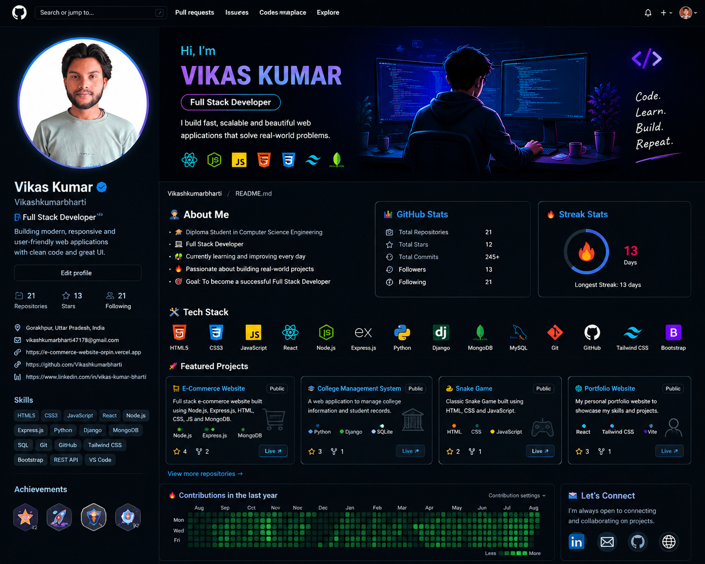

  

<h1># 👋 Hi, I'm Vikas Kumar</h1>

### 💻 Full Stack Developer | Computer Science Engineering Student

  

  
  
  

  

---

## 🚀 About Me

I'm **Vikas Kumar**, a Computer Science Engineering student and aspiring **Full Stack Developer** passionate about creating modern, responsive, and user-friendly web applications.

I enjoy transforming ideas into real-world projects and continuously improving my development skills through practical development and problem solving.

- 🎓 Computer Science Engineering Student
- 💻 Full Stack Web Developer
- ⚛️ React & Modern Frontend Development
- 🐍 Python & Django Backend Development
- 🟢 Node.js & Express.js
- 🗄️ MongoDB, SQL & SQLite
- 🌱 Currently improving my Full Stack Development skills
- 🚀 Building real-world projects
- 🎯 Goal: Become a highly skilled professional software developer

---

## 🛠️ Tech Stack

### 💻 Languages

  

### ⚛️ Frontend Development

  

### ⚙️ Backend Development

  

### 🗄️ Database

  

### 🔧 Tools

  

---

## 🚀 Featured Projects

### 🛒 E-Commerce Website

A full-stack e-commerce application focused on product management, user experience and backend functionality.

**Technologies:**  
`Python` `Django` `HTML` `CSS` `JavaScript` `SQLite`

---

### 🎓 College Management System

A full-stack college management application designed to manage students, courses and academic information.

**Technologies:**  
`Python` `Django` `HTML` `CSS` `JavaScript` `SQLite`

---

### 🌐 Personal Portfolio

A modern responsive developer portfolio showcasing my skills, projects and development journey.

**Technologies:**  
`React` `Vite` `JavaScript` `Tailwind CSS` `GSAP`

---

### 🐍 Snake Game

A browser-based game created to practice JavaScript logic, DOM manipulation and interactive web development.

**Technologies:**  
`HTML` `CSS` `JavaScript`

---

## 📊 GitHub Statistics

  

  

---

## 🔥 GitHub Streak

  

---

## 📈 GitHub Activity

  

---

## 🎯 Currently Learning

| Technology | Focus |
|---|---|
| ⚛️ React | Advanced Frontend Development |
| 🟨 JavaScript | Modern JavaScript & Web APIs |
| 🐍 Django | Backend & REST APIs |
| 🟢 Node.js | Server-side Development |
| 🍃 MongoDB | Database & Backend Integration |
| 🔐 Git & GitHub | Version Control & Collaboration |

---

## 💡 What I Love Building

- 🌐 Modern Responsive Websites
- ⚛️ React Applications
- 🛒 E-Commerce Platforms
- 🎓 Management Systems
- 🔐 REST APIs
- 📊 Dashboard Applications
- 🤖 AI-powered Web Applications
- 💻 Developer Tools

---

## 🌐 Portfolio

  

---

## 💼 Let's Connect

---

## 🤝 Open to Collaboration

I'm interested in:

- 🚀 Full Stack Development Projects
- 💻 Open Source Contributions
- 🤝 Developer Collaboration
- 🌱 Learning Opportunities
- 💼 Professional Opportunities

---

### 🚀 Let's Build Something Amazing Together!

**Learning • Building • Improving**

---

  <b>⭐ If you like my work, consider starring my repositories!</b>

